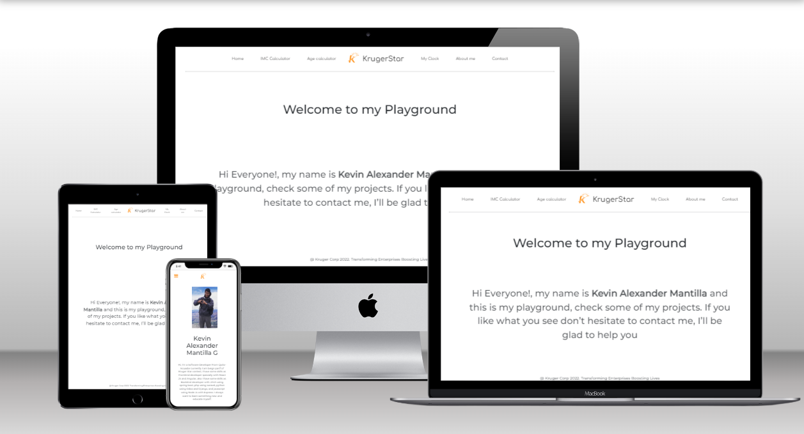

# Kruger Star Playground
> Primer proyecto Primer proyecto Primer proyecto Primer proyecto Primer proyecto Primer proyecto Primer proyecto Primer proyecto Primer proyecto Primer proyecto Primer proyecto Primer proyecto Primer proyecto Primer proyecto Primer proyecto Primer proyecto 

## Built with 

- JavaScript
- React.JS 18
- Netlify
- HTML + CSS

## Live demo

[Live demo link](https://kruger-star-playground-km.netlify.app/)

## Run it locally

 ### Setup

 - Clone this repo using `git clone https://github.com/khabLexander/taller-portafolio`

 ### Comands

 - `npm i`
 - `npm start`

## 👤 Author

 **Kevin Alexander Mantilla G**

- GitHub: [@khabLexander](https://github.com/khabLexander)
- Twitter: [@Khabin14](https://twitter.com/Khabin14)
- LinkedIn: [Kevin Alexander Mantilla](https://www.linkedin.com/in/kevin-alexander-mantilla-3238a5213/)

## 🤝 Contributing

- **Juan Sebastian Sotomayor**

## 🤲 Show your support

- Give me a ⭐ if you like it!